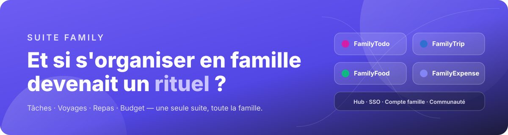
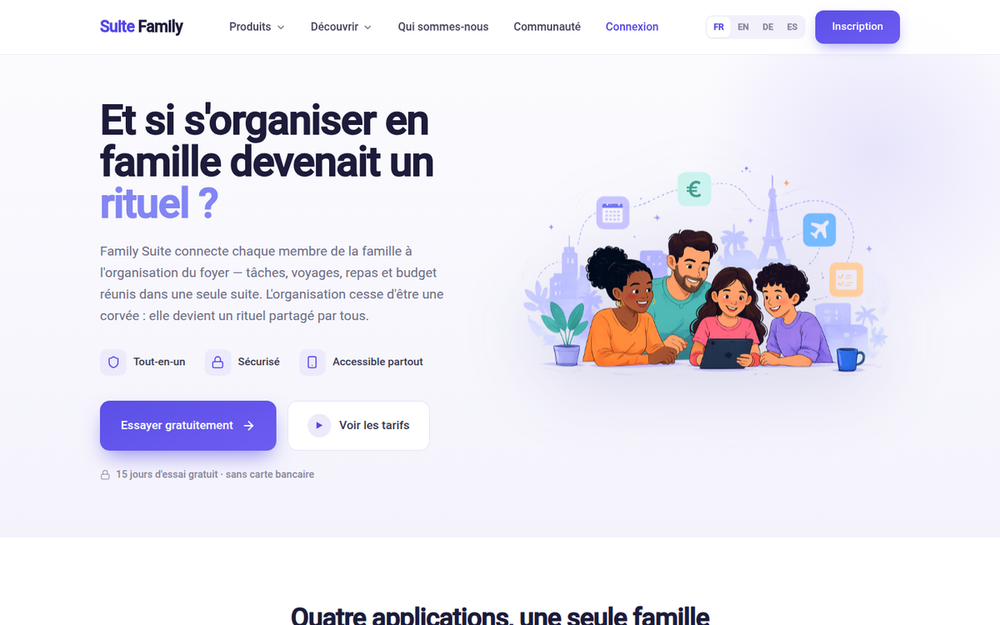
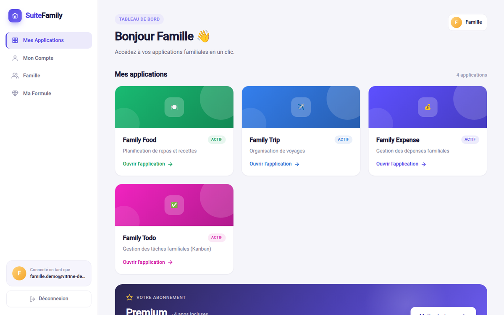
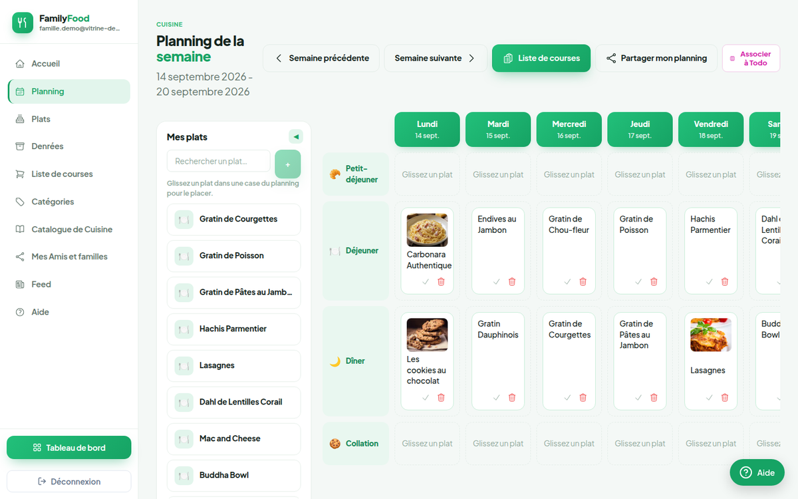
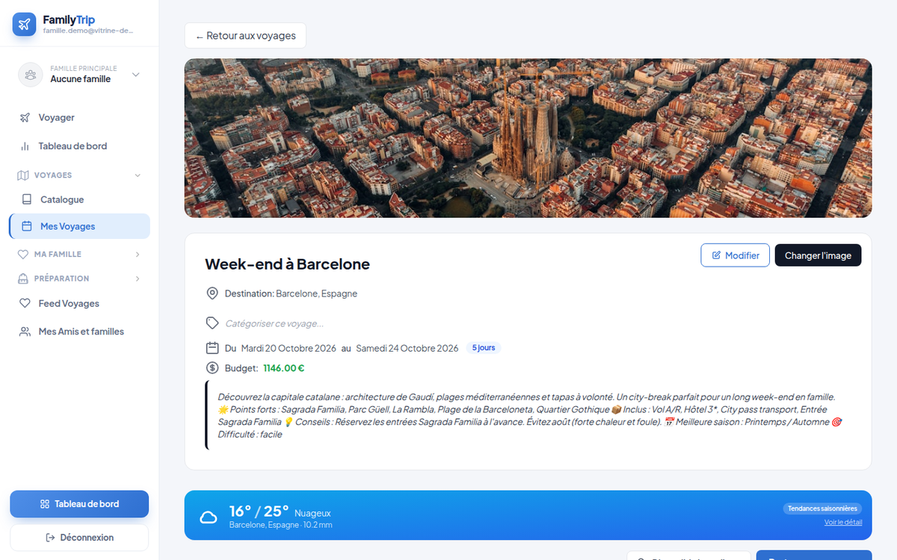
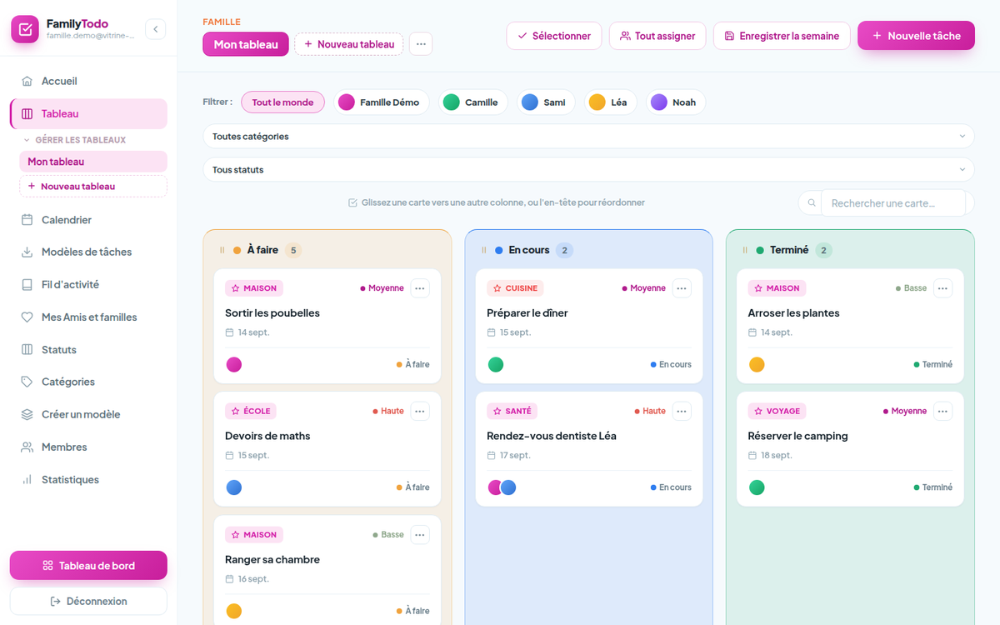
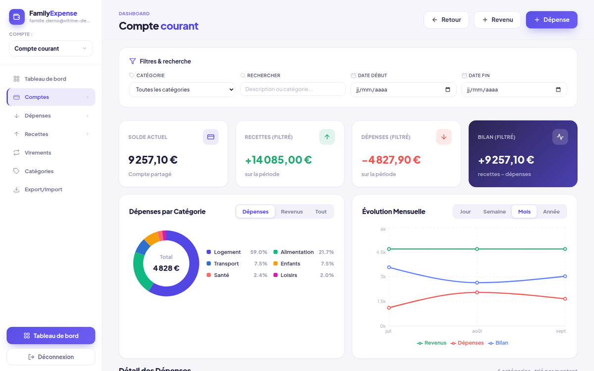
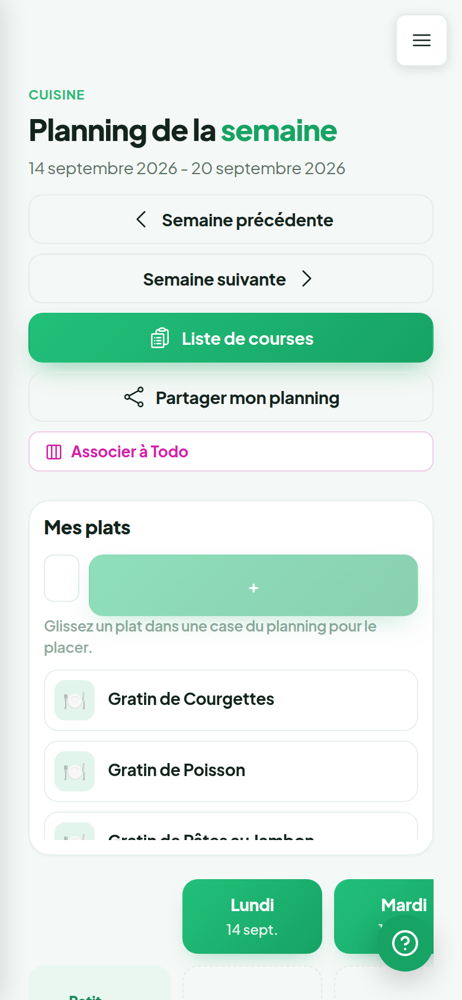
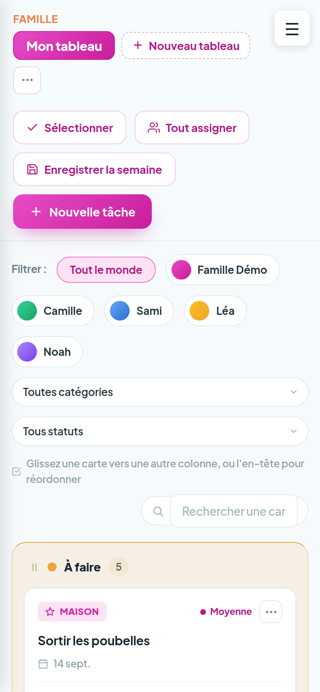
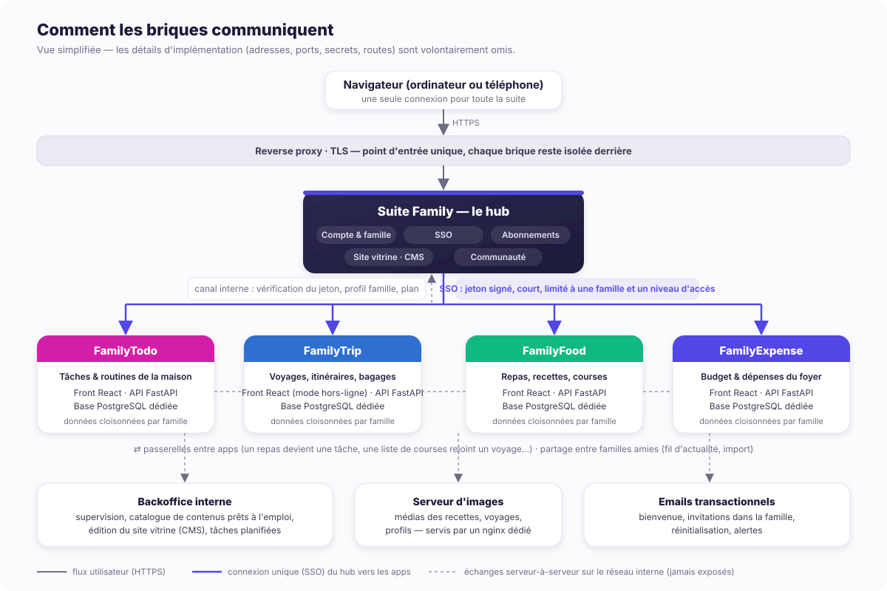

  

  <strong>Suite Family</strong> connecte chaque membre de la famille à l'organisation du foyer : 
  tâches, voyages, repas et budget réunis dans une seule suite, avec une seule connexion.

  
  
  
  
  

  <em>Dépôt vitrine privé — le code source n'est pas publié ici. Toutes les captures proviennent d'un compte de démonstration avec des données fictives.</em>

---

## 🎯 Le but du projet

Suite Family n'est pas « une application de plus ». C'est une réponse à la vie de famille telle qu'elle se vit vraiment — et à la charge mentale qui va avec.

Tout est parti de situations concrètes : planifier les repas de la semaine, organiser un voyage, répartir les tâches de la maison, savoir où part l'argent du foyer. Chaque application répond à **un moment précis de la vie du foyer**, et toutes partagent la même famille, le même compte et les mêmes règles.

Trois convictions structurent le produit :

| | |
|---|---|
| **Une famille, un compte** | Un seul espace, une seule connexion. Les membres (conjoint, enfants, grands-parents…) sont invités avec des droits par application. |
| **Du contenu prêt à l'emploi** | Recettes, modèles de voyages, routines hebdomadaires : on démarre avec quelque chose de concret, pas une page blanche. |
| **Des apps qui se parlent** | Un repas devient une tâche, une liste de courses rejoint un voyage, et les familles amies partagent leurs meilleures idées. |

## 🧩 Les applications

| Application | Ce qu'elle fait |
|---|---|
|  | **L'organisation de la maison, en équipe.** Tableau Kanban et vue calendrier, tâches assignées par membre (couleur + avatar), récurrences, modèles de semaines types, statistiques par membre. |
|  | **Vos voyages en famille, sans stress.** Itinéraire jour par jour, hébergements, activités, budget prévu/réel, valises par personne, équipements, météo, mode « voyage » consultable hors-ligne. |
|  | **Les repas de la semaine, sans prise de tête.** Planning glisser-déposer, carnet de recettes, catalogue de cuisine, liste de courses générée automatiquement et cochée à plusieurs. |
|  | **Le budget familial, enfin limpide.** Comptes partagés, catégories avec enveloppes, transactions et virements, graphiques mensuels, export. |
| -1c1b3a?style=flat-square) | **Le socle.** Site vitrine multilingue, inscription et connexion unique (SSO), gestion de la famille et des invitations, abonnements, espace communauté. |

## 📸 Captures d'écran

<table>
  <tr>
    <td width="50%"></td>
    <td width="50%"></td>
  </tr>
  <tr>
    <td align="center">Site vitrine — accueil</td>
    <td align="center">Hub — une connexion, toutes les apps</td>
  </tr>
  <tr>
    <td width="50%"></td>
    <td width="50%"></td>
  </tr>
  <tr>
    <td align="center">FamilyFood — planning de la semaine</td>
    <td align="center">FamilyTrip — fiche voyage, budget et météo</td>
  </tr>
  <tr>
    <td width="50%"></td>
    <td width="50%"></td>
  </tr>
  <tr>
    <td align="center">FamilyTodo — tableau Kanban par membre</td>
    <td align="center">FamilyExpense — répartition et évolution mensuelle</td>
  </tr>
</table>

  
  &nbsp;&nbsp;
  

Responsive sur mobile ; FamilyTrip est en plus une PWA installable, consultable hors connexion.

## 🏗️ Architecture : comment les briques communiquent

  

Les principes, sans entrer dans les détails d'implémentation :

- **Un hub, des applications autonomes.** Chaque application a son propre front, sa propre API et sa propre base de données. Elle peut vivre, être déployée et évoluer indépendamment des autres.
- **Une seule connexion (SSO).** L'utilisateur se connecte une fois sur le hub. Pour ouvrir une application, le hub lui délivre un jeton signé, à courte durée de vie, limité à *une* famille et à *un* niveau d'accès. L'application ne fait confiance qu'à ce jeton.
- **Des données cloisonnées par famille.** Chaque famille est un espace isolé dans chaque application ; un membre invité n'accède qu'aux applications et aux droits que l'administrateur de la famille lui a donnés.
- **Un canal interne, jamais exposé.** Les échanges serveur-à-serveur (vérification du jeton, profil de la famille, plan d'abonnement, catalogue de contenus) passent par un réseau interne, hors de portée du navigateur.
- **Des passerelles entre apps.** Un repas planifié peut devenir une carte Todo, une liste de courses se rattache à un voyage, etc. — toujours à l'initiative de l'utilisateur.
- **Une communauté entre familles.** Deux familles qui s'ajoutent en amies peuvent partager des recettes, des semaines de menus, des voyages ou des routines, et importer ce qui leur plaît dans leur propre espace.
- **Un backoffice interne** pour la supervision, l'édition du site vitrine (CMS) et l'administration du catalogue de contenus prêts à l'emploi.

## 🛠️ Stack technique

| Couche | Choix |
|---|---|
| **Front** | React, Vite, React Router, composants d'interface communs à toute la suite (toasts, dialogues, menus mobiles), cartes Leaflet côté voyages, PWA avec cache hors-ligne pour FamilyTrip |
| **Internationalisation** | Interface disponible en français, anglais, allemand et espagnol ; contenus du site vitrine éditables via un CMS |
| **API** | Python · FastAPI · SQLAlchemy · Pydantic — une API par application, documentée automatiquement (OpenAPI) |
| **Données** | PostgreSQL, une base par application ; données sensibles chiffrées au repos ; migrations SQL versionnées |
| **Authentification** | SSO maison à jetons signés (cryptographie asymétrique), rafraîchissement de session, double authentification (TOTP) optionnelle |
| **Infra** | Docker Compose, reverse proxy nginx avec TLS, serveur d'images dédié, tâches planifiées (Celery / Redis) côté backoffice |
| **Services tiers** | Emails transactionnels (bienvenue, invitations, réinitialisation), paiement des abonnements, météo et géocodage ouverts |
| **Qualité** | Guide de codage partagé, lint et formatage automatisés, harnais de validation Node pour les moteurs métier, revues de code par lots |

## 🔐 Sécurité & données

- Aucun secret, aucune adresse interne, aucun identifiant ne figure dans ce dépôt vitrine.
- Les données personnelles (noms, téléphones, contenus sensibles) sont chiffrées au repos ; les familles sont strictement isolées les unes des autres.
- Le hub ne relaie jamais un jeton non vérifié ; les redirections SSO sont limitées à une liste d'hôtes autorisés.
- Conformité RGPD : export et suppression des données à la demande, conservation limitée après résiliation.

## 🤖 Un projet vibe codé

Suite Family est **vibe codé** : il a été conçu, développé et fait évoluer **en binôme avec une IA** (Claude Code, d'Anthropic), du premier écran jusqu'à la préparation de la mise en production.

**Le rôle humain** — la vision produit, l'expérience utilisateur, les arbitrages d'architecture, les tests en conditions réelles avec la famille, la revue et la validation de chaque livraison.

**Le rôle de l'IA** — l'implémentation, les refactorisations, la documentation, les scripts de validation, les revues de code systématiques.

**Les garde-fous** qui rendent ça tenable à cette échelle :

- un guide de codage écrit, appliqué à chaque fonctionnalité et rappelé dans chaque consigne ;
- des standards d'interface partagés entre les applications (mêmes composants, même menu mobile, jamais de dialogues natifs du navigateur) ;
- un programme de revue de code par application, avec rapports et corrections par lots ;
- une mémoire de projet (décisions, pièges connus, conventions) qui persiste d'une session à l'autre.

Quelques ordres de grandeur, au moment de cette vitrine :

| | |
|---|---|
| Applications & services | 1 hub · 4 applications familiales · 1 backoffice · reverse proxy · serveur d'images |
| Conteneurs en développement | ≈ 30 |
| Code source | ≈ 195 000 lignes (JavaScript/JSX ≈ 96 k · Python ≈ 54 k · CSS ≈ 31 k · SQL ≈ 13 k) dans ≈ 1 300 fichiers |
| Langues d'interface | 4 |
| Démarrage | début 2026 |

## 📌 Statut

Le projet est en **pré-production** : les applications exposées sont durcies, des familles bêta-testeuses l'utilisent au quotidien, et les versions mobiles natives sont à l'étude.

---

  © 2026 Suite Family · Tous droits réservés · Dépôt vitrine, code source non public.

